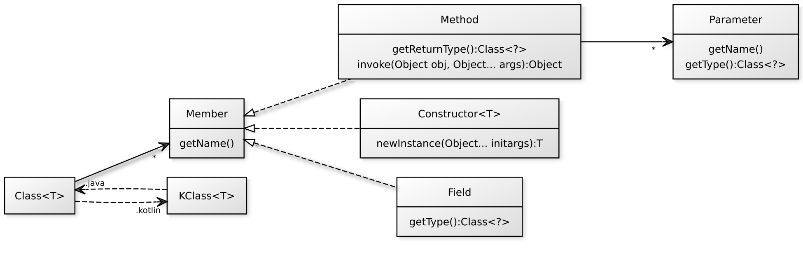
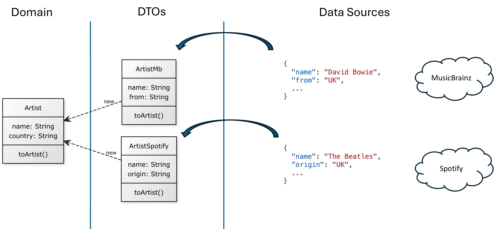

# Reflection (parte III)

## Java API Reflect

- Descrição da API Java para reflexão. 



- Correspondente ao `KClass`: `Class`
  - Para obter um objeto `Class` de uma classe: usar `.class`.
    - _e.g._, `MyClass.class`
  - Para obter um objeto `Class` de um objeto: usar o método `getClass()`.
    - Este método faz parte da classe `Object`, que toda classe herda em Java.
    - _e.g._, `obj.getClass()`
- 3 diferentes implementações dos membros:
  - `Method`: métodos da classe ou interface.
  - `Field`: campos (atributos).
  - `Constructor`: construtores de uma classe (diferente de `Method`).
- Alguns métodos de um objeto `Class`:
  - `String getName()`: nome da classe ou interface.
  - `Field[] getFields()`: obtém um Array de campos públicos (classes e superclasses).
  - `Field[] getDeclaredFields()`: obtém um Array de campos declarados com qualquer visibilidade.
  - `Field getDeclaredField(String)`: obtém um campo declarado a partir de um dado nome.
  - `Method[] getMethods()`: obtém um Array de métodos públicos (classes e superclasses).
  - `Method[] getDeclaredMethods()`: obtém um Array de métodos declarados com qualquer visibilidade.
  - `Method getDeclaredMethod(String, Class[])`: obtém um método declarado a partir de um dado nome e um Array de objetos `Class` correspondente aos parâmetros do método.
- Alguns métodos de um `Field`:
  - `String getName()`: obtém o nome do campo.
  - `Object	get(Object obj)`: obtém o valor de um campo de um objeto específico.
- Alguns métodos de um `Method`:
  - `String getName()`: obtém o nome do método.
  - `int getParameterCount()`: obtém a quantidade de parâmetros do método.
  - `Class<?> getReturnType()`: obtém o objeto Class que representa o valor retornado.
  - `Object	invoke(Object obj, Object... args)`: chama o método para um objeto juntamente aos seus parâmetros e retorna o valor suposto do método.
- Demonstrações de uso da API Reflect Java em: [week01/sample02-reflect-cmdline/SampleClass.java](../../week01/sample02-reflect-cmdline/SampleClass.java)

### Análise Simples dos Bytecodes

- `javap`: comando que permite inspecionar os bytecodes JVM dos ficheiros `.class`.
    - A saída depende das opções utilizadas.
    - Quando não é utilizada nenhuma opção, o comando `javap` imprime os campos _protected_ e _public_, e os métodos das classes que lhe são passadas.
- Por exemplo, a partir do projeto [sample04-logger](../sample04-logger), executar:
    - `javap build/classes/kotlin/test/pt/isel/Rectangle.class`
        - A saída é:
      ```
      Compiled from "Rectangle.kt"
      public final class pt.isel.Rectangle {
        public pt.isel.Rectangle(int, int);
        public final int getWidth();
        public final int getHeight();
        public final int getArea();
      }
      ```
    - `javap build/classes/java/test/pt/isel/RectJava.class`
        - A saída é:
      ```
      Compiled from "RectJava.java"
      public class pt.isel.RectJava {
        public pt.isel.RectJava(int, int);
        public int getWidth();
        public int getHeight();
        public int getArea();
      }
      ```
- Note que as saídas são bastante similares.
  - O compilador Kotlin adiciona anotações que permitem identificar os membros como propriedades.
    - No exemplo, `area` é uma propriedade.
    - Para a JVM, os _getters_ são sintaticamente adicionados.
  - No código em Java, os _getters_ foram adicionados manualmente (convenção de uso).
    - Os campos (_fields_) são apenas aqueles declarados como atributos.
    - De facto, não há um campo `area`.
    - A área pode apenas ser obtida chamando-se o método `getArea()`.

### Exemplo Logger

- Implementação do _Logger_ com a API Reflect Java.

  ```java
  import java.lang.reflect.Field;
  import java.lang.reflect.Method;
  import static java.lang.System.lineSeparator;
  
  public class Logger {
      public static void log(Appendable out, Object obj) throws Exception {
          Class<?> clazz = obj.getClass();
          out.append("Object of Type " + clazz.getSimpleName() + lineSeparator());
          for (Field f : clazz.getDeclaredFields()) {
              f.setAccessible(true);
              System.out.println(f.getName() + ": " + f.get(obj));
          }
          for (Method mth : clazz.getDeclaredMethods()) {
              if (isGetter(mth)) {
                  String propName = mth.getName().replaceFirst("^get", "");
                  Object propValue = mth.invoke(obj);
                  out.append("  - " + propName + ": " + propValue + lineSeparator());
              }
          }
      }
  }
  ```

- Método `isGetter`:

  ```java
    static boolean isGetter(Method method){
        return (method.getName().startsWith("get") // starts with 'get'
                && method.getParameterCount() == 0 // There is no parameters
                && ! method.getReturnType().equals(void.class) // Returned type is not void
        );
    }
  ```

- Esta implementação é similar ao `logGetters()` do Kotlin.
  - No entanto, ela funciona para classes escritas em Java e em Kotlin.
- Com a API Reflect do Kotlin, o `logGetters()` funciona apenas para classes escritas em Java.
  - As anotações do Kotlin impedem o acesso aos métodos _getters_ da JVM.
  - Logo, são necessários os dois métodos para que os resultados sejam compatíveis: 
    - `log()`: para classes escritas em Kotlin;
    - `logGetters()`: para classes escritas em Java.

## NaiveMapper

- Exemplo, chamado `NaiveMapper`, será usado agora para ilustrar mais um uso da Reflexão.
  - Este exemplo inspira-se em bibliotecas como o AutoMapper ou o MapStruct.
  - Faz o mapeamento de dados entre objetos de diferentes tipos.
    - _i.e._, copia automaticamente valores de propriedades/campos de um objeto para propriedades/campos correspondentes de outro objeto.
  - Útil para implementar objetos de transferência de dados (DTO - _data transfer objects_), modelos de domínio ou modelos de visualização.

### Exemplo de Motivação

- DTO ArtistMb: objeto que representa um artista em MusicBraiz.
- DTO ArtistSpotify: objeto que representa um artista no Spotify.
- Artist: objeto que representa um artista no domínio Artist.



- Mapeamento manual:
  ````kotlin
  fun ArtistMb.toArtist() = Artist(name, from, /* other properties */)
  // ...
  fun ArtistSpotify.toArtist() = Artist(name, origin, /* other properties */)
  ````
- Precisamos de um mapeamento automático.
  - `val artist = artistMb.mapTo(Artist::class)` 
  - `val artist = artistSpotify.mapTo(Artist::class)`

### Implementação I

- Através do uso de propriedades mutáveis, _i.e._ `KMutableProperty`.
- Consideram-se as seguintes restrições:
  1. O tipo de destino deve ter um construtor sem parâmetros (_i.e._, vamos usar `createInstance()`);
  2. As propriedades de destino são mutáveis.
  3. As propriedades de origem e destino partilham o mesmo nome e tipo.

- Implementação disponível em [sample05-naivemapper](../sample05-naivemapper)

### Implementação II

- Através do uso de parâmetros construtores.
  - Elimina as restrições 1 e 2 da Implementação I. 
  - Chama construtor via: `fun call(vararg args: Any?): R`