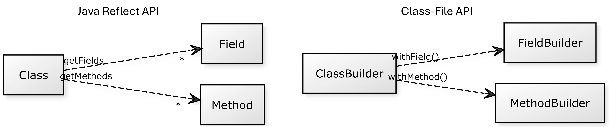

# Metaprogramação (parte I)

- A metaprogramação é uma técnica de programação onde um programa de computador interage com outros programas, seja _lendo_ os existentes ou _gerando_ novos.
  - A reflexão permite a leitura, mas não a geração.
  - Por exemplo, para o `NaiveMapper`, iremos substituir a reflexão pela geração dinâmica de `mapFrom`.
- Metaprogramação em tempo de compilação:
  - Envolve a criação de código (gerar ou alterar o código) durante a fase de compilação.
  - Geralmente, mediante a _templates_ e/ou _macros_, gerando um código-fonte intermédio.
  - C/C++ e Lisp usam isto.
- Metaprogramação em tempo de execução:
  - Gera código dinamicamente e manipula o código em tempo de execução.
  - Reflexão é um exemplo.
- Exemplo em Javascript (ficheiro [`index.js`](../sample22-class-file/src/main/index.js)): uso da função construtora `Function` (cria um objeto `Function`).
  ```js
  // Extract the statement from the command line arguments
  const statement = process.argv[2]
  
  // Build a new function using the provided statement
  const dynamicFun = Function(statement)
  
  // Now you can call the dynamically created function
  dynamicFun()
  ```
  - Argumento é uma String que contém o código-fonte em Javascript.
  - Exemplo de execução em linha de comando: `node index.js "console.log('Hello, world');"`
  - Outro exemplo: `node index.js "function circleArea(r) { return Math.PI * r * r; }; console.log('Circle area with radius 7 = ' + circleArea(7));"`

- Algumas bibliotecas para metaprogramação em tempo de execução na JVM: 
  - [**Class-file API**](https://docs.oracle.com/en/java/javase/22/vm/class-file-api.html)
  - [ASM](https://asm.ow2.io/)
  - [Javassist](https://www.javassist.org/)
  - [Byte Buddy](https://bytebuddy.net/)
  - [Cojen Maker](https://github.com/cojen/Maker)
  - [JavaPoet](https://github.com/square/javapoet)
  - [KotlinPoet](https://square.github.io/kotlinpoet/)

## Class-file API

- Foi originalmente proposta num _preview_ do JDK 22, JEP 457.
  - Proposta finalizada foi lançada no JDK 24 com poucas modificações.
    - JEP 484: https://openjdk.org/jeps/484
  - JEP significa _JDK Enhancement Proposal_
- Fornece uma API padrão para analisar, **gerar** e transformar ficheiros de classe Java.
  - O nosso foco aqui será na geração de código.
- Java Reflection API _vs._ Class-file API.
  
- A seguir, o padrão de código para a geração de uma classe com o Class-file API:

```kotlin
ClassFile.of().build(...) { clb: ClassBuilder ->
    clb
        .withFlags(...)
        .withField(...)
        .withMethod(...) { mb: MethodBuilder ->
            mb.withCode { cob: CodeBuilder ->
                cob
                    .aload(0)
                    ....
                    .return_()
            }
        }.withMethod(...) { mb: MethodBuilder ->
            mb.withCode { cob: CodeBuilder ->
                cob
                    .ldc(...)
                    ....
                    .ireturn()
            }
        }
}
```

- `ClassFile.of()` retorna um `ClassFile`.
- Para o método `build()`, deve-se indicar o descritor do nome da classe e um handler que recebe um `ClassBuilder`.
  - Para o descritor, pode-se usar o `ClassDesc.of(classname)`, onde `classname` é uma String que contém o nome qualificado da classe.
  - O consumidor do tipo `ClassBuilder` é uma função que implementa a construção da classe.
- A maioria dos métodos de um `ClassBuilder` retorna o próprio `ClassBuilder`.
- Alguns dos métodos são:
  - `withFlags()`: indicar as _flags_ da classe através de constantes, como `ACC_PUBLIC`, `ACC_FINAL`.
    - Único parâmetro é um `int` cujo bits indicam as flags. 
    - Combinar múltiplas flags: operação `or` entre as constantes.
      - _e.g._, `withFlags(ACC_FINAL or ACC_PUBLIC)`
  - `withField()`: indicar os campos da classe, se houver.
    - 1.º parâmetro: String com o nome do campo.
    - 2.º parâmetro: descritor do campo.
    - 3.º parâmetro: flags do campo ou um handler que recebe um `FieldBuilder`.
  - `withMehtod()`: indicar os métodos da classe.
    - 1.º parâmetro: String com o nome do método.
    - 2.º parâmetro: descritor do método.
    - 3.º parâmetro: _flags_.
    - 4.º parâmetro: um handler que recebe um `MethodBuilder`.
  - Para cada método:
    - `withCode()`: constrói o corpo do método (opcodes + argumentos).
      - Único parâmetro é um handler que recebe um `CodeBuilder`.
  
### Constantes

- Pacote [`java.lang.classfile`](https://docs.oracle.com/en/java/javase/22/docs/api/java.base/java/lang/classfile/ClassFile.html)
- Constantes que começam com ACC: modificadores de acesso.
  - _e.g._, `ACC_PUBLIC`, `ACC_FINAL`.

### Descritores de Constantes

- Pacote [`java.lang.constant.ConstantDescs`](https://docs.oracle.com/en/java/javase/22/docs/api/java.base/java/lang/constant/ConstantDescs.html).
  - Constantes que começam como CD: descritores de tipos ou classes.
    - _e.g._, `CD_Object` (`java.lang.Object`), `CD_int` (primitivo `int` em Java).
  - `MTD_void`: descritor para um método sem parâmetros que retorna void (`()V`).
  - `INIT_NAME`: nome especial do método construtor `<init>`.

- Quando um descritor de tipo não está disponível entre a constantes, podemos utilizar:
  - `ClassDesc.of()`: gera descritor de um tipo.
    - _e.g._, `ClassDesc.of("pt.isel.Bar")` gera o descritor `Lpt/isel/Bar;` que representa a classe `Bar`.
  - `MethodTypeDesc.of()`: gera descritor de um método.
    - 1.º parâmetro: um `ClassDesc` que representa o descritor do tipo de retorno do método. 
    - 2.º parâmetro: um `varargs ClassDesc` que representam os múltiplos descritores de tipo dos parâmetros do método.
    - _e.g._, `MethodTypeDesc.of(CD_int)` gera um descritor de um método sem parâmetros que retorna um `int`.

### Exemplo 1 (muito simples): Classe Bar

- O baseline da classe Bar (em Java):
  ```java
  package pt.isel;
  public class Bar {
      public int foo() { return 67895; }
  }
  ```
- Analisar a saída de `javap -p -v build/classes/java/main/pt/isel/Bar.class` para construir o bytecode.
  ```text
  {
    public pt.isel.Bar();
      descriptor: ()V
      flags: (0x0001) ACC_PUBLIC
      Code:
        stack=1, locals=1, args_size=1
           0: aload_0
           1: invokespecial #8                  // Method java/lang/Object."<init>":()V
           4: return
  
    public int foo();
      descriptor: ()I
      flags: (0x0001) ACC_PUBLIC
      Code:
        stack=1, locals=1, args_size=1
           0: ldc           #11                 // int 67895
           2: ireturn
  }
  ```
- Exemplo está disponível em no ficheiro [GenBar.kt](../sample22-class-file/src/main/kotlin/pt/isel/GenBar.kt)
  - Exemplo de uso da classe: [AppDemoClassFileApi.kt](../sample22-class-file/src/main/kotlin/pt/isel/AppDemoClassFileApi.kt)

### Exemplo 2: Classe Counter

- A classe `Counter` tem o objetivo de criar um objeto contador.
- Neste exemplo, é usada a interface `Sum.kt` para:
  - servir como base de uma classe _baseline_ (`CouterBaseline`),
  - e como _casting_ no uso de um objeto do tipo `Counter`.
- 
- Saída de `javap -p -v build/classes/java/main/pt/isel/CouterBaseline.class`
```text
{
  private final int nr;
    descriptor: I
    flags: (0x0012) ACC_PRIVATE, ACC_FINAL

  public pt.isel.CounterBaseline(int);
    descriptor: (I)V
    flags: (0x0001) ACC_PUBLIC
    Code:
      stack=2, locals=2, args_size=2
         0: aload_0
         1: invokespecial #1                  // Method java/lang/Object."<init>":()V
         4: aload_0
         5: iload_1
         6: putfield      #7                  // Field nr:I
         9: return
      LineNumberTable:
        line 6: 0
        line 7: 4
        line 8: 9
      LocalVariableTable:
        Start  Length  Slot  Name   Signature
            0      10     0  this   Lpt/isel/CounterBaseline;
            0      10     1    nr   I

  public int add(int);
    descriptor: (I)I
    flags: (0x0001) ACC_PUBLIC
    Code:
      stack=2, locals=2, args_size=2
         0: aload_0
         1: getfield      #7                  // Field nr:I
         4: iload_1
         5: iadd
         6: ireturn
      LineNumberTable:
        line 10: 0
      LocalVariableTable:
        Start  Length  Slot  Name   Signature
            0       7     0  this   Lpt/isel/CounterBaseline;
            0       7     1 other   I
}
```
- Exemplo está disponível em no ficheiro [GenCounter.kt](../sample22-class-file/src/main/kotlin/pt/isel/GenCounter.kt)
  - Exemplo de uso da classe: [AppDemoClassFileApi.kt](../sample22-class-file/src/main/kotlin/pt/isel/AppDemoClassFileApi.kt)
