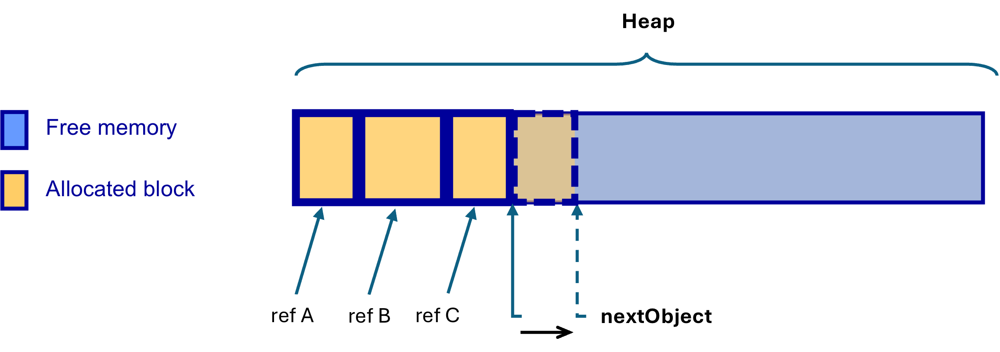
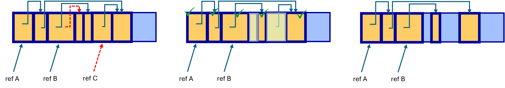
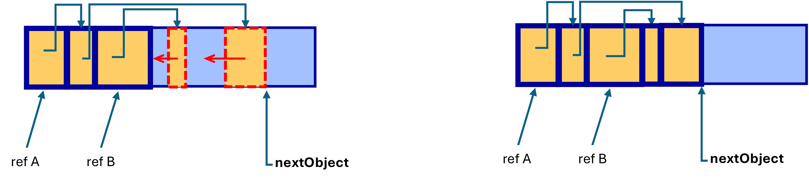
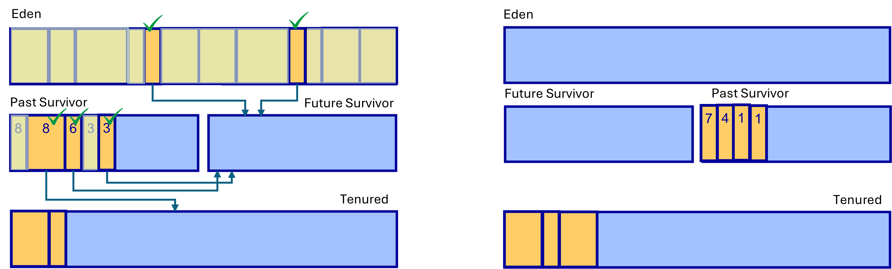

# Garbage Collection e Ações de Limpeza (parte I)

- A JVM gere automaticamente a memória.
  - Através do _**Garbage Collector**_ (GC).
- Apesar de adicionar sobrecarga em tempo de execução, previne _bugs_ de desenvolvimento de _software_.
- Além disso, a gestão automática de memória da JVM é altamente otimizada.
  - Sobrecarga tende a ser irrelevante, principalmente em aplicações de longa duração de execução, como aplicações _web_.
- É possível configurar e ajustar o GC.
  - No entanto, o GC é tão otimizado que geralmente não é recomendado alterar as suas configurações. 
  - Isto está fora do escopo desta disciplina.
    - Documentação oficial: https://docs.oracle.com/en/java/javase/22/gctuning

## Managed Heap

- Mais precisamente, a JVM gere as instâncias criadas durante a execução.
- As instâncias ou **objetos de referência** são alocadas na **Heap**.
- Representação das principais áreas de memória em tempo de execução da JVM:


- Exemplo de código em Java:
```java
public class BankAccount {
  static int totalAccounts = 0; // Static field: method area 

  // Instance fields: heap
  public String accountHolder;
  public double balance;

  // Constructor
  public BankAccount(String holder, double initialDeposit) { // local variables: stack
    this.accountHolder = holder;
    this.balance = initialDeposit;
    totalAccounts++;
  }

  // Method to deposit money
  public void deposit(double amount) { // local variable: stack
    double previousBalance = this.balance; // local variable: stack
    if (amount > 0) {
      this.balance += amount;
      System.out.println("Deposit amount " + amount + " to " + this.accountHolder);
      System.out.println("Previous Balance: " + previousBalance);
      System.out.println("New Balance: " + this.balance);
    }
  }

  // Main method to demonstrate usage
  public static void main(String[] args) {
    BankAccount account1;        // Type reference: stack
    account1 = new BankAccount("Alice", 100); // Reference object: heap
    account1.deposit(50);
    new BankAccount("Bob", 200); // Reference object (with no variable type reference): heap
    System.out.println("Total Accounts: " + BankAccount.totalAccounts);
  }
}
```

- Os **objetos de referência**, criados a partir do `new`, encontram-se na _heap_.
  - Campos de instância são armazenados também na _heap_.
- As **variáveis de tipo de referência** são alocados na _stack_.
  - Elas apenas armazenam o endereço do objeto de referência.
- As **variáveis locais** também são alocadas na _stack_.
- As **variáveis estáticas** são armazenadas na área de método (_per-class_).
  - São da classe e não do objeto.
- Strings literais são armazenados no _Runtime Constant Pool_ (área de método).
  - Strings também podem ser objetos de referência.
- A área de método é logicamente parte da _heap_.
  - Mas é mantida fora do _garbage collection_.

### Princípios da Localidade

- Memória física é onde realmente os dados estarão armazenados.
- Organização da memória física (memória de _hardware_):
  - É formada por uma hierarquia de memórias (_e.g._, registos, cache L1, L2 e memória principal).
  - Níveis mais altos tendem a ter acesso mais rápido, porém a capacidade de armazenamento é menor.
    - O oposto também é verdade.
- **Localidade espacial**: acesso a dados em sequência (_e.g._, _array_).
  - É mais eficiente para a memória mantê-los numa mesma sequência consecutiva de endereços de memória _(e.g._, contíguos).
  - A gestão da memória física é feita em blocos.
- **Localidade temporal**: acesso a dados frequentemente acessados (_e.g._, num _loop_).
  - É mais eficiente para a memória mantê-los em memória de acesso mais rápido (_e.g._, _cache_).

### Exemplo Simples de Gestão Dinâmica da _Heap_

- A JVM aloca automaticamente um **bloco de memória** suficientemente grande para acomodar um novo objeto no _heap_.
  - Blocos tendem a ser consecutivos até que começam a ser desalocados.
  - Nota: estes blocos não são equivalentes aos blocos da memória física.
- **Identificação de blocos de memória livre** (_free memory blocks_):
  - Sempre que um objeto de referência é desalocado (_e.g._, primitiva _free_), a referência de memória é adicionada a uma **lista de blocos de memória livre**.
  - Esta lista é usada para buscar blocos de memória livres para serem reutilizados.
- Problemas:
  - **Fragmentação**: blocos desalocados podem não ter espaço suficiente para alocar novos objetos, causando desperdício de memória.
  - **Problema de localidade espacial**: desempenho é degradado devido a objetos consecutivamente acessados não estarem contíguos.
    - Blocos precisam de mais acessos à memória física, o que torna a execução ineficiente. 
    - Causado pela fragmentação.
  - **_Memory leak_**: objeto não foi desalocado da memória e não tem mais a referência.
  - **Busca por blocos de memória**: torna ineficiente o processo de alocação de memória para um objeto.
- Ilustração do problema de fragmentação: 
  - O novo objeto não pode ser alocado na _heap_ mesmo com mais da metade da memória livre.


## Garbage Collector

- Tem a função de executar periodicamente a gestão dinâmica da _Heap_.
- Um objeto que não é mais referenciado é chamado de **inalcançável** (_unreachable_).

### Etapas da Gestão da Heap com o GC
1) **Alocar um objeto o mais rápido possível**.
  - Não fazer a busca por blocos livres em memória para alocar um objeto.
  - Assumir que a memória é "infinita" e que os objetos não se tornam inalcançáveis.
  - Logo, toda a alocação é feita a partir do ponteiro para o próximo objeto.



2) **_Marking_**: definir quais objetos são alcançáveis e quais são inalcançáveis.
   - GC percorre uma árvore de referências para marcar os objetos que são alcançáveis.
   - Uma _flag_ **_mark_** é usada para indicar que um objeto é alcançável.
   - Referência raiz ➜ pontos iniciais da árvore, como:
     - variáveis locais (e parâmetros de funções), 
     - campos estáticos,
     - variáveis _top-level_.



3) **_Sweeping_**: objetos **não marcados** na etapa anterior são **removidos**.
   - São os objetos inalcançáveis.
   - As _flags_ dos objetos restantes são limpas para o próximo ciclo.

4) **_Compactation_**: processo de mover os blocos alcançáveis para o espaço livre anterior.
   - Objetivo: tornar o espaço de memória alocado na _heap_ mais contíguo.
     - Evitar fragmentação.
   - _Stop-the-world_: todos os _threads_ param para fazer o processo de compactação de memória.
     - Garantir consistência enquanto a memória é reorganizada.



5) **Abordagem Geracional**:
   - O processo de compactação pode ser demorado a medida que o número de objetos na _heap_ cresce.
   - Reduzir latência: limitar o conjunto de objetos a ser analisado pelo GC.
     - Ao invés de visitar toda a _heap_, o GC deve concentrar-se numa porção menor.
   - Que parte da _heap_ deve ser analisada?
     - Observações experimentais mostraram que objetos criados mais recentemente tornam-se inacessíveis mais rapidamente.
     - [Documentação: distribuição típica do tempo de vida dos objetos](https://docs.oracle.com/en/java/javase/22/gctuning/garbage-collector-implementation.html#GUID-71D796B3-CBAB-4D80-B5C3-2620E45F6E5D__DISTRIBUTION_LIFETIMES).
   - É necessário, portanto, conhecer a **idade dos objetos**.
     - Um objeto recém-alocado começa na geração 0.
     - Cada vez que um objeto sobrevive a um ciclo de recolha de lixo, o seu número de geração é incrementado. 
     - Assim sendo, um objeto com um número de geração maior é mais velho. 
   - Uso do **_Generation Scavenging Algorithm_**.

### _Generation Scavenging Algorithm_

- _Heap_ é dividida em duas áreas:
  - **_Young Generation_**: contém os objetos mais recentes.
    - **_Eden_**: onde os novos objetos são alocados.
    - Mais duas áreas _Survivor_: **_Past Survivor_** e **_Future Survivor_**.
  - **_Old Generation_** (ou _tenured_): contém objetos mais antigos, que sobreviveram por mais tempo.
    - São considerados antigos aqueles objetos que tem idade acima de um limiar _tenured_ (_threshold_).
- **Minor GC**:
  - GC é iniciado quando o _Eden_ está lotado (sem espaço disponível).
  - Objetos das áreas _Eden_ e _Past Survivor_ são marcados (_marking_) e removidos (_sweeping_).
    - Objetos marcados como alcançáveis são movidos (_compactation_) para a área _Future Survivor_.
    - As idades dos objetos são incrementadas.
    - Os objetos que têm idade acima do limiar _tenured_ são movidos para a área _Old Generation_.
    - Neste ponto, _Eden_ e _Past Survivor_ ficam vazios para o próximo ciclo.
    - _Past Survivor_ troca de papel (_swapping_) com o _Future Survivor_.



- Ver também [Tutorial de JVM _Generations_](https://www.oracle.com/webfolder/technetwork/tutorials/obe/java/gc01/index.html#t3).

- **Major GC**:
  - Processo de limpeza pode ser necessário na área _Old Generation_.
    - Por exemplo, quando esta área encontra-se cheia.
  - Neste caso, é necessário analisar toda a árvore de referências.
  - Tende a ser um processo mais lento.
    - Com períodos de _stop-the-world_ longos.